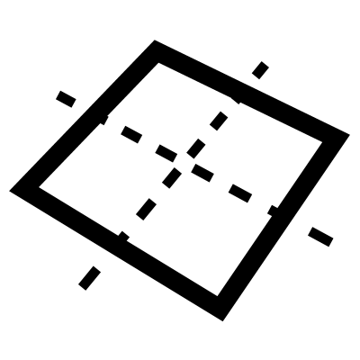

# Surface

基于 X 和 Y 尺寸创建矩形曲面，或从一组曲线创建平面边界曲面。

**矩形曲面：** 提供 X 和 Y 尺寸以生成朝向输入平面的矩形。
**边界曲面：** 提供曲线列表以创建由这些曲线包围的平面（此模式下忽略 X 和 Y 输入）。

## 菜单选项

**Plane World XY**  
在世界 XY 平面上创建矩形平面

**Plane World YZ**  
在世界 YZ 平面上创建矩形平面

**Plane World ZX**  
在世界 ZX 平面上创建矩形平面

## 输入

**Plane**  
放置曲面的平面

**X**  
X 尺寸

**Y**  
Y 尺寸

**Curves**  
用于平面边界曲面的可选曲线

## 输出

**Surfaces**  
最终输出曲面

