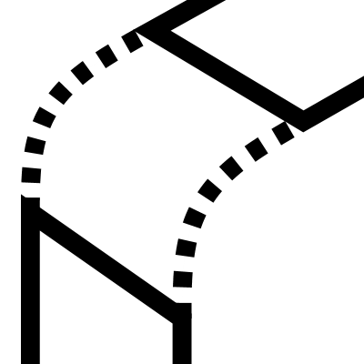

# Blend Surface

在两个曲面的指定边之间创建混合曲面。允许控制每侧的曲率影响并调整段数以定义混合分辨率。

## 输入

**Brep A**  
第一个 Brep

**Brep B**  
第二个 Brep

**Edge A**  
第一个 Brep 上的边

**Edge B**  
第二个 Brep 上的边

**Blend A**  
第一个 Brep 对曲面曲率的影响

**Blend B**  
第二个 Brep 对曲面曲率的影响

**Number of Sections**  
控制混合曲面的段数

## 输出

**surface**  
混合曲面

