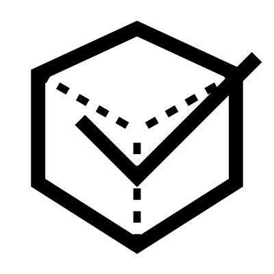

# Optimize

清理并简化 Brep 几何体。具体的优化方法在菜单中，以便您仅应用必要的优化。

## 菜单选项

**Shrink Face**  
任何超出边的面将缩减以匹配其修剪边的大小
(有点技术性，但有助于处理面时防止意外结果)

**Merge Edges**  
合并碎片化的边

**Merge Faces**  
任何共面的面将合并为单个平面

**Solid Orient**  
确保曲面朝外

**Compact**  
压缩 Brep

## 输入

**Brep**  
主要 Brep

## 输出

**Brep**  
优化后的 Brep

