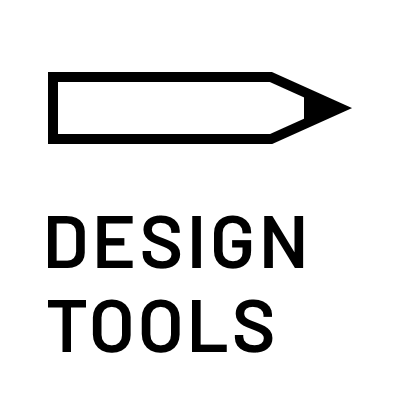
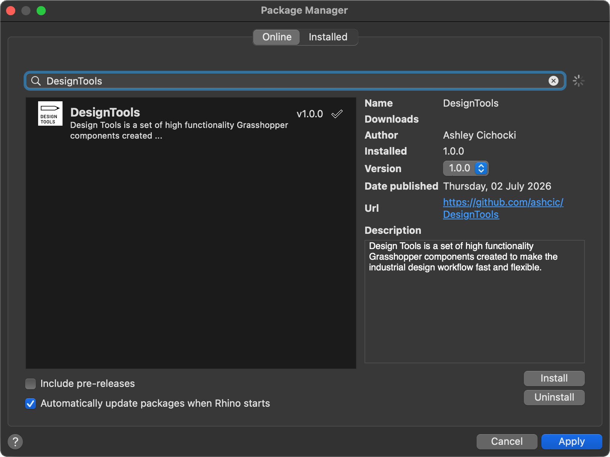

  

# Design Tools for Grasshopper

Design Tools 是一组高性能 Grasshopper 组件，旨在使工业设计工作流程快速且灵活。

组件本身只是故事的一半，另一个方面是工作流。获得这种速度和敏捷性取决于理解如何构建。Design Tools 使该过程变得超级简单，是探索您在 Grasshopper 中可以做的所有惊人事情的绝佳切入点。

---

## 入门

Design Tools 适用于 Windows 或 Mac，Rhino 8。获取它们的最佳位置是 Rhino 内置的**包管理器**。这将确保所有内容都位于正确位置，并帮助您始终保持最新版本。

只需搜索 **"DesignTools"：**

---

## 学习工作流

教程和示例文件很快将开始出现在此仓库和 YouTube 上...

同时，您可以在这里找到一些涵盖所有基础知识的帮助文档。
