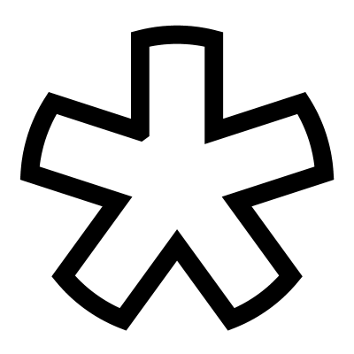

# Asterisk

Creates an asterisk-like shape with multiple radiating arms. You can customize the overall radius, the width of each arm, and the total number of arms. The component offers three distinct styles: **Flat**, **Arched**, and **Round**.

## Menu Options

**Flat**  
Create flat ends on each arm 

**Arched**  
Create arched ends on each arm that match the radius of the construction circle

**Round**  
Create fully rounded ends on each arm

## Inputs

**Radius**  
Radius of the containing circle

**Width**  
Width of each arm

**Number of Arms**  
Number of arms

## Outputs

**Curves**  
Asterisk as individual curves

**Joined**  
Asterisk as joined curves

**Points**  
Control Points

