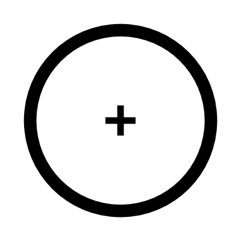

# Circle

Creates a set of arcs that form a circle based on a specified radius and the number of segments.

This component provides:

**Arcs:** The individual curved segments making up the shape.
**Points:** The shared endpoints between each arc.

___

## Inputs

**Radius**
Radius of the circle

**Number**
Number of segments of the circle

___

## Outputs

**Arcs**
The split arcs

**Points**
The points between arcs
