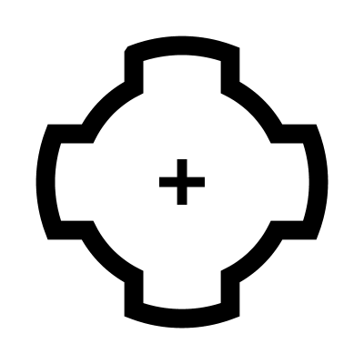

# Cog

Generates gear-like geometry (cogs) based on a circular base. It produces individual curves, joined curves, and control points.

The component provides different tooth styles:

**Angled**: Teeth with adjustable slanted sides.
**Square sides**: Rectangular teeth perpendicular to the circle.
**Flat sides**: Simple flat-edged teeth.
**Right-Angled**: Teeth oriented at a specific right angle.
 
Use *Radius* and *Segments* for the basic shape, then adjust *Angle*, *Offset*, and *Extend* to fine-tune the tooth thickness and spacing.

## Menu Options

**Angled**  
Teeth with adjustable slanted sides

**Square sides**  
Rectangular teeth perpendicular to the circle

**Flat sides**  
Simple flat-edged teeth

**Right-Angled**  
Teeth oriented at a specific right angle

## Inputs

**Radius**  
Radius of the containing circle

**Segments**  
Number of teeth

**Angle**  
Angle of the sides of the teeth

**Offset**  
Controls the size of the teeth

**Extend**  
Changes the width of the teeth

## Outputs

**Curves**  
Individual curves

**Joined**  
Joined curves

**Points**  
Control Points

**Notes**  
A description of how to use this tool

