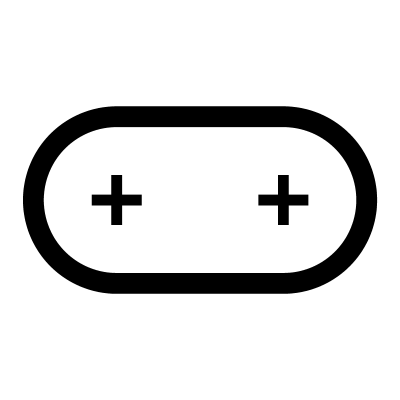

# Pill

Creates a Pill or Race-track shape based on X and Y dimensions.  Use 'Orient' to adjust where it is placed, which is useful for building out details which are aligned to a corner.

## Menu Options

**Smooth**  
Toggles between sharp geometric corners and smooth, continuous curves

**Pivot Width**  
If this is selected, the number for X is the distance between the two pivot points
If this is unselected (default), the number for X is the total width

## Inputs

**X**  
The X dimension

**Y**  
The Y dimension

**Orient**  
The orientation of the Pill

## Outputs

**Curves**  
Individual curves

**Joined**  
Joined curves

**Pivots**  
Pivot Points at the centres of the arcs

