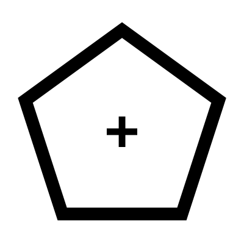

# Polygon

Creates a regular polygon based on a radius and number of sides, with customizable corner types that you can select from the menu.

## Menu Options

**C2 Corners**  
Smooth blend radius on each corner

**Arc Corners**  
Simple arc radius on each corner

**Chamfered Corners**  
Flat edge instead of an arc

**C2 Arc Corners**  
Produces a C2 smooth radius in each corner that imitates an arc

**Match**  
Scale the polygon so that the corner radius touch the construction circle

## Inputs

**Radius**  
Radius of the construction circle

**Sides**  
Number of sides

**Fillet**  
Corner fillets

**Blend**  
Corner fillet blends

**Match**  
Match the dimensions of the construction circle

## Outputs

**Curves**  
Individual curves

**Joined**  
Joined curves

**Circle**  
The construction circle

**Centres**  
The centres of the fillets

**Points**  
Description

