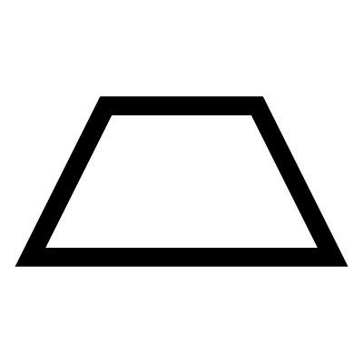

# Quadrilateral

Creates a Parallelogram, Trapezium, Rhombus, or Kite shape. The angle of the sides can either be set by using the angle input or the inset input.

## Menu Options

**Parallelogram**  
Creates a Parallelogram

**Trapezium**  
Creates a Trapezium

**Rhombus**  
Creates a Rhombus

**Kite**  
Creates a Kite, or a Diamond shape

## Inputs

**X**  
The X dimension

**Y**  
The Y dimension

**Insets**  
The amount to inset from the edge

**Angles**  
The angle of the sides

## Outputs

**Curves**  
Individual curves

**Joined**  
Joined curves

**Points**  
Corner Points

