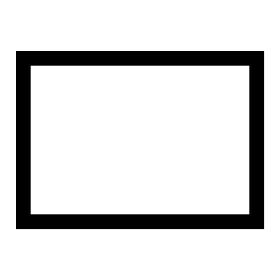

# Rectangle

Creates a rectangle with customizable dimensions and corner styles. You can choose between sharp corners, chamfered edges, or various types of rounded (Arc) and blended corners.

## Menu Options

**C2 Corners**  
Smooth blend radius on each corner

**Arc Corners**  
Simple arc radius on each corner

**Chamfered Corners**  
Flat edge instead of an arc

**C2 Arc Corners**  
Produces a C2 smooth radius in each corner that imitates an arc

## Inputs

**X**  
The X Dimension

**Y**  
The Y Dimension

**Radii**  
You can add multiple dimensions for multiple radii

**Blends**  
Control how much the corners blend into the sides

## Outputs

**Curves**  
The rectangle as separate curves

**Joined**  
The rectangle as joined curves

**Points**  
The corner points

**Notes**  
A description of how to use this tool

