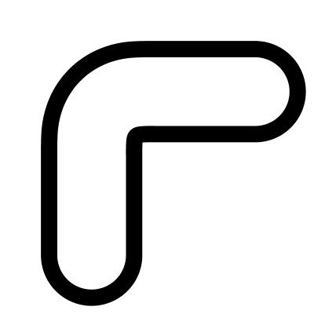

# Sausage

Creates a thickened, capped geometry shape around input curves with customizable end styles.

**Features:**

* Adjust the **thickness** of the main body.
* Choose from various **end cap types** (Round, Flat, Arrow, Circle, Square, or Bar).
* Control the length and scale of **head extensions** and **barbs**.

The component outputs joined geometry, individual curves, and hatches suitable for export to Adobe Illustrator.

*Note: Input curves must be flat on the XY plane.*

___

## Inputs

**Curves**
Input curves (must be flat on XY plane)

**Width**
Thickness of the line

**Head**
Length of the head

**Barb**
Size of the exension

**start**
Start head type ID (0=Round, 1=Flat, 2=Arrow, 3=Circle, 4=Square, 5=Bar)

**end**
End head type ID (0=Round, 1=Flat, 2=Arrow, 3=Circle, 4=Square, 5=Bar)

___

## Outputs

**Curves**
Individual curves

**Joined**
Joined curves

**Hatch**
Hatches can be exported to Adobe Illustrator as solid objects

**Notes**
A description of how to use this tool
