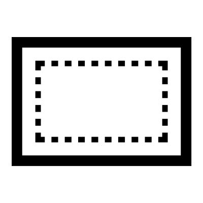

# Re-Rectangle

Constructs a rectangle, pill shape, or rounded box based on reference geometry.

## Menu Options

**C2 Corners**  
Smooth blend radius on each corner

**Arc Corners**  
Simple arc radius on each corner

**Chamfered Corners**  
Flat edge instead of an arc

**C2 Arc Corners**  
Produces a C2 smooth radius in each corner that imitates an arc

## Inputs

**Geometry**  
The main geometry

**Offset**  
Description

**Radii**  
You can add multiple dimensions for multiple radii

**Blends**  
Control how much the corners blend into the sides

**Keeps**  
which corners should match the originals

**Match**  
Description

## Outputs

**Curves**  
The initial rectangle as separate curves

**Offsets**  
The offset rectangles as separate curves

**Joined**  
The rectangle as joined curves

**Points**  
The corner points

**Values**  
The various dimensions of the initial geometry

**Notes**  
A description of how to use this tool

