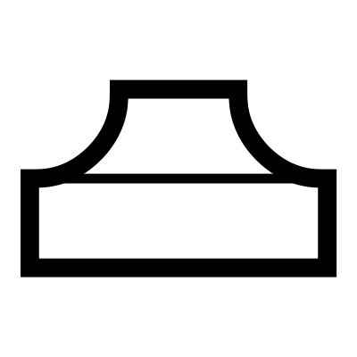

# Curved Volcano

Creates a curved, ramped protrusion from a base geometry using profile curves. This component blends a surface into a volcano-like shape with customizable transitions.

## Menu Options

**Max 32**  
32 Sectors or control curves smoothing the surface
Slower, and best suited to complex curves

**High 21**  
21 Sectors or control curves smoothing the surface
Best suited to complex curves

**Medium 16**  
16 Sectors or control curves smoothing the surface
Standard amount

**Low 12**  
12 Sectors or control curves smoothing the surface
Best suited to simple curves

**Min 7**  
7 Sectors or control curves smoothing the surface
Fast, best suited to simple curves

**Cap**  
Add caps to opens ends of the geometry, creating a closed brep

**From Edge**  
Measure the offset from the edge of the geometry so that it is responsive to the geometry's size

## Inputs

**Brep**  
The main geometry

**Curves**  
Main profile of the volcano

**Outer**  
Optional external boundary profile

**Offset**  
Distance offset

**Angle**  
Angle of the blend at the top edge

**Blend A**  
Weight of the blend at the top

**Blend B**  
Weight of the blend at the bottom

**Fillet**  
Top edge fillet radius

**Blend**  
Blend on the edge fillet

## Outputs

**Brep**  
Final geometry

**Planes**  
Planes for orientation

**Top Curves**  
Top profiles

**Mid Curves**  
Middle profiles

**Bottom Curves**  
Bottom profiles

**Fillet Curves**  
Fillet curves (for checking curvature)

**Side Curves**  
Side curves (for checking curvature)

