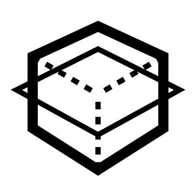

# Extrude Indent

This is the workhorse of your WorkFlow.  It creates extruded shapes, indents, or through-holes from curves. It allows for generating 3D forms with fillets and blends, as well as carving simple indentations into existing solid or hollow geometry.

## Menu Options

**Max 27**  
27 Sectors or control curves smoothing the surface
Slower, and best suited to complex curves

**High 21**  
21 Sectors or control curves smoothing the surface
Best suited to complex curves

**Medium 17**  
17 Sectors or control curves smoothing the surface
Standard amount

**Low 13**  
13 Sectors or control curves smoothing the surface
Best suited to simple curves

**Min 9**  
9 Sectors or control curves smoothing the surface
Fast, best suited to simple curves

## Inputs

**Curves**  
The main curves

**Brep**  
Brep to modify

**Fillets**  
Fillets on the modified edges

**Blends**  
Blends on the fillets

**Extrude**  
Distance of the extrude

**Inset**  
Inset of the main curves

**Flip**  
Change the orientation:
- If extruding, flip extrudes from the centre equally on both sides
- If indenting, flip gives the negative space of the indent

## Outputs

**Breps**  
The modified brep

**Planes**  
Planes used for placing objects on the modified brep

**Edges A**  
The top edge

**Edges B**  
The bottom edge

**Notes**  
A description of how to use this tool

