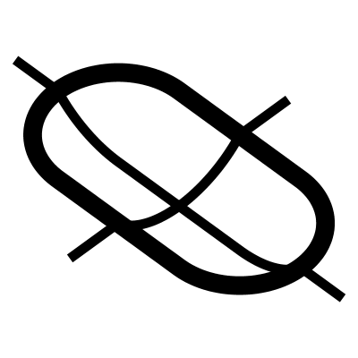

# Groove

Creates a groove or nipple shape and a cutting edge so that it can easily be put into a surface. You can adjust the dimensions of the profile using Length, Radius, and Depth, while Fillet and Blend parameters allow for smoothed edges.

## Menu Options

**Smooth**  
Creates a Pill shape that has C2 shaped curves approximating arcs in order to create C2 surfaces
(not yet implemented)

## Inputs

**Length**  
Length of the groove

**Radius**  
Width of the groove

**Depth**  
Depth of the groove

**Fillet**  
Edge fillet

**Blend**  
Blend of the edge fillet

## Outputs

**Brep**  
The final brep

**Curves**  
Edge curves

**Profile**  
Profile cuves

