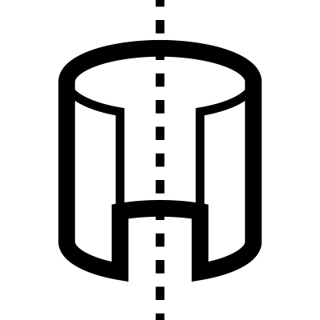

# Revolve

Revolves profile curves around a line to create 3D surfaces or solids. The rotation angle can be adjusted, and there are options to cap the start and end of the resulting geometry.

___

## Inputs

**Curves**
Profile curves

**Angle**
The angle through which the profile is revolved

**Axis**
Line around which the surfaces are revolved

___

## Outputs

**Revolve**
Final surfaces

**joined**
Joined final surfaces

___

## Menu Options

**start_cap**
Adds a cap on the end which is at the start of the curve

**end_cap**
Adds a cap on the end which is at the end of the curve