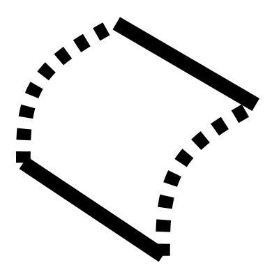

# Sweep

Sweeps profile curves along rail paths to create surfaces and solids. 

## Key Functions:

**Origin** input to control the orientation and positioning of the profiles
**Cap** menu option to automatically close the ends of the geometry.

___

## Inputs

**Rails**
Path curves defining the sweep geometry

**Profile**
Cross-section profiles to be swept along the rails

**Origin**
Reference point for profile orientation and positioning

**Sectors**
Number of subdivisions along the rail

___

## Outputs

**Breps**
Generated swept Brep surfaces

**Curves**
Boundary curves from the profile sweep

**Notes**
A description of how to use this tool

___

## Menu Options

**Cap**
Add caps to opens ends of the geometry, creating a closed brep