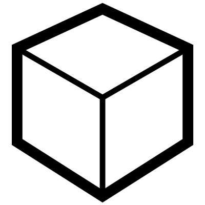

# Cube

Creates a 3D cube based on specified X, Y, and Z dimensions. Useful for 'Box Select'.

Includes an option to either center the cube on its midpoint or align it starting from its base.

___

## Inputs

**X**
X Dimension

**Y**
Y Dimension

**Z**
Z Dimension

___

## Outputs

**cube**
Final Cube

___

## Menu Options

**Centre**
If true, the centre of the cube will be at the origin
If false, the base of the cube will be at the origin