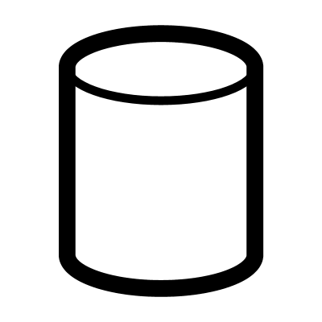

# Cylinder

Creates an advanced cylinder or cone with customizable fillets.  I

## Menu Options

**C2 Corners**  
Smooth blend fillet on each edge

**Arc Corners**  
Simple arc fillet on each edge

**Chamfered Corners**  
Flat edge instead of an arc

**C2 Arc Corners**  
Produces a C2 smooth fillet in each edge that imitates an arc

**Cap**  
Add caps to opens ends of the geometry, creating a closed brep

**Centre**  
If true, the centre of the cylinder will be at the origin
If false, the base of the cylinder will be at the origin

## Inputs

**Top and Bottom Radius**  
Top and Bottom Radius (add 2 values to make a cone)

**Height**  
Height of the cylinder

**Sections**  
Number of sections

**Fillets**  
Fillets at the bottom and top

**Blends**  
Blends at the bottom and top

## Outputs

**Brep**  
Resulting joined cylinder parts

**Profile**  
Side Profile

**Circles**  
Top and Bottom Circles

**Arcs**  
Base arcs for each section

