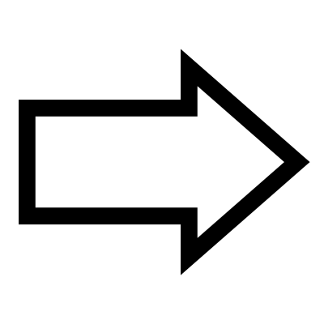

# Arrow

Creates a flat arrow shape

**Length:** The overall length of the arrow.
**Width:** The thickness of the shaft.
**Head:** The size of the arrowhead.
**Barb:** The width of the decorative barbs.

Includes a right-click menu option to toggle between single and double-ended arrows.

## Menu Options

**Ends**  
Adds arrow heads to both ends of the arrow

## Inputs

**Length**  
Overall length of the arrow

**Width**  
Width of the shaft

**Head**  
Length of the head

**Barb**  
Width of the barbs

## Outputs

**Curves**  
Individual curves

**Joined**  
Joined curves

**Hatch**  
Hatches can be exported to Adobe Illustrator as solid objects

**Points**  
Control Points

