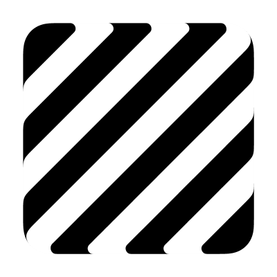

# Zebra

Check surface curvature, by visualizing zebra stripes over a surface to help analyze curvature and smoothness. The size and rotation of the stripes can be adjusted using the scale and rotate inputs.

## Inputs

**Brep**  
Input Brep

**scale**  
Change the size or thickness of the stripes

**Rotate**  
Change the angle of the stripes

