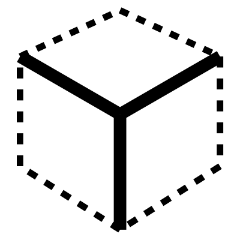

# Edges

Get specific edges from a Brep geometry. It allows you to filter for:

* Naked edges
* Smooth edges
* Sharp edges

The component can also organize these curves into continuous loops.

## Menu Options

**Naked**  
Get the unjoined edges

**Smooth**  
Get the joined edges that are smoothly connected

**Sharp**  
Get the joined edges that are sharply connected

**Loop**  
Organize these curves into continuous loops.

**Highlight Naked Edges**  
Useful for finding gaps between surfaces that are not joined

## Inputs

**Brep**  
The main brep

**Tolerance**  
Tolerance

## Outputs

**Edge Curves**  
Edge curves of the Brep

**Edge Numbers**  
The number id of each edge

