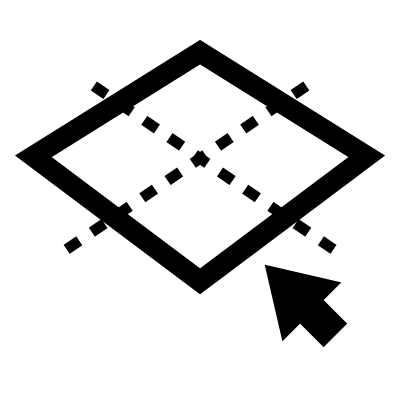

# Plane Select

Use a Plane to select geometry.  Divide the geometry into two groups — those situated above/on a reference plane and those below it.

**Selection Levels:**

* Geometry
* Faces
* Edges

## Menu Options

**Overlapping**  
Includes any part of the object that is above or on the plane.

**Strictly Inside**  
Only includes objects entirely above the plane.

**Geometry**  
Selects full geometry objects

**Faces**  
For Breps, selects certain faces

**Edges**  
For Breps, selects certain edges

## Inputs

**Geometry**  
The main geometry

**Plane**  
The selection plane

## Outputs

**Geometry Inside**  
The geometry inside the boxes

**Geometry Outside**  
The geometry outside the boxes

**Pattern**  
The index values for all the included geometry

