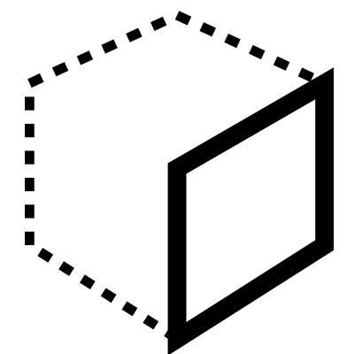

# Locate

Locate a plane on geometry in order to place things on it

## Menu Options

**Simple**  
Finds the centre using bounding box rather than UVs

**Box**  
Treat the objects as a bounding box and align to one of the 6 sides

## Inputs

**Geometry**  
The main geometry

**Face**  
select a face

**Position**  
0-10 chooses a position on the selected face

**Inset U**  
Moves the plane in U

**Inset V**  
Moves the plane in V

**Offset W**  
Offsets the plane from the surface

## Outputs

**Plane**  
The final plane

**Surface**  
Extracted surface

**Edges**  
The edges of the extracted surface

**Body**  
The remaining, non-extracted, part of the geometry

**Notes**  
A description of how to use this tool

