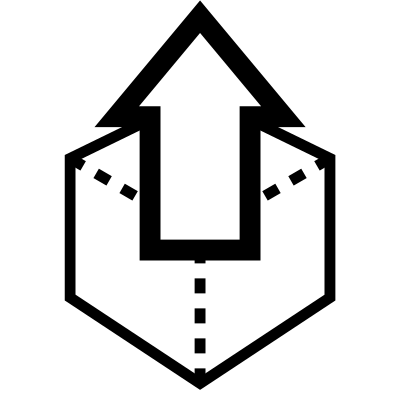

# Nudge

Nudge geometry in small amounts in X, Y and Z.  This is useful for making precise manual adjustments to the position of objects.

## Menu Options

**X Axis**  
X Direction

**Y Axis**  
Y Direction

**Z Axis**  
Z Direction

## Inputs

**Geometry**  
Geometry to nudge

## Outputs

**Geometry**  
Nudged geometry

