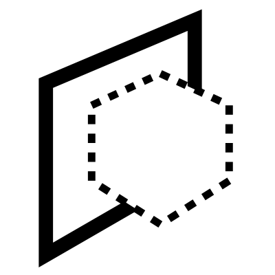

# Place

Moves geometry from its current location on the XY plane onto a target plane, matching the orientation and position of the target plane.

___

## Inputs

**Geometry**
Description

**Plane**
Plane to move geometry to

___

## Outputs

**geometry**
Moved Geometry

**Transform**
Vector Move - useful for inpuptting into a Move component and moving other geometry
